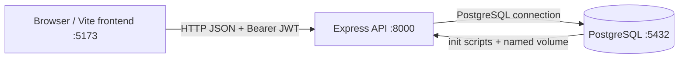

# 0.2.3 — Integration & Deployment Topology

Docker Compose runs `db` and `api` on the default private network. PostgreSQL is exposed on the host for local development; the API waits for the database health check before starting. The frontend remains a local Vite process and connects through `VITE_API_BASE_URL`.